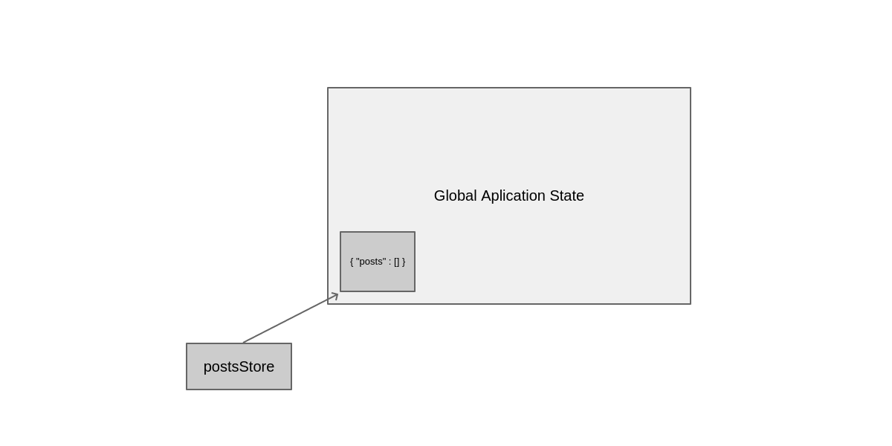
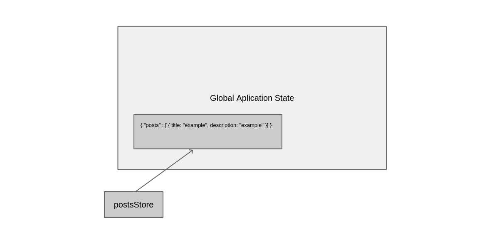

## Introduction to State

This library handles state a little differently than you might be accustomed to in your day-to-day frontend development, especially if you do a lot of coding with Redux. To some extent we like Redux, at least we like the features it offers such as having an immutable application state and allowing for a way to walk through and replay changes in your application. However, for our purposes it is too verbose and makes the developer think about things that they should not care about. The developer should only worry about his application such as building a login form or a sign in page and not about how to manage a full update cycle of application states and dispatch events for various components.

### Library Design Goals

What we have tried to achieve with this library is the following architectural design goals.

1. Provide all the features of Redux.
2. Reduce the amount of code required to manage state in frontend applications.
3. Reduce the amount of cognitive overhead required.
4. Make building your applications less about state and more about the features of the application.

### The Three Principles of Snapshot

These are the same as Redux! However, we don't absolutely force you to have read-only state, technically you could use some JavaScript hacks to mutate your state, we suggest not doing that though.

#### Single Source of Truth

**The state of your whole application is stored within an object tree**

```ts
const { State } = require("@stembord/state");
const applicationState = new State();
```

In order to start adding things to the application state you need to create **stores**. Conceptually, these provide snapshots into the application state.

```ts
// filename: posts_store.js
const postsStore = applicationState.createStore("posts", { posts: [] });
```

The following image illustrates how our state looks after the above call.



#### State is read-only

**The only way to change the state is to call `updateState(...)` on a store object**

You can make this call from anywhere in your application, although when building a ReST API you would typically do it after receiving the server response.

```ts
// filename: posts_store.js
const axios = require("axios");

function createPost(title, description) {
    axios
        .post("/api/posts", { title: title, description: description })
        .then(update);
}

function update(response) {
    const newPost = response.data;

    postsStore.updateState(function(currentState) {
        currentState.update("posts", function(posts) {
            return (posts || []).push(newPost);
        });
    });
}
```

When `updateState(...)` on a store is called an event is triggered called `set-state-for` and any objects anywhere in your application which are listening to this event will be able to automatically pull in updates if they need the new information associated with the newly updated store.

This is what our state looks like now.



That's it! Notice there are no reducers, filters, dispatchers, constants, none of that. If anyone is familiar with clojurescript you can think of this state library as doing an atomic `swap!` on a subportion of the global application tree.

The bottom line is you don't actually have a copy of the state you have a series of functions to manipulate a little piece of the global state.

## Using in the Real world

Right now we only use this with React it could be used with most view libraries, the connect library is here [state-react](https://gitlab.com/stembord/ts-state-react)
